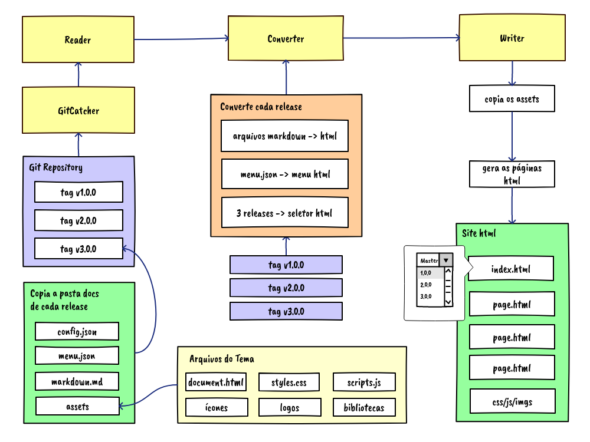

# Arquitetura

O MarkHelp é capaz de transformar qualquer projeto contendo arquivos markdown em HTML, formatando-os de uma forma padrão. Mas é possível personalizar várias coisas, de forma que a geração dos documentos se adapte às mais diversas necessidades.

## Sumário

-   [Início](index.md)
-   [Implementando projetos PHP](utilizar-como-biblioteca.md)
-   [Utilizando no Terminal Linux](utilizar-no-terminal.md)
-   [Personalizando e Configurando](configuracoes.md)
-   [Quero ajudar o projeto](como-ajudar.md)
