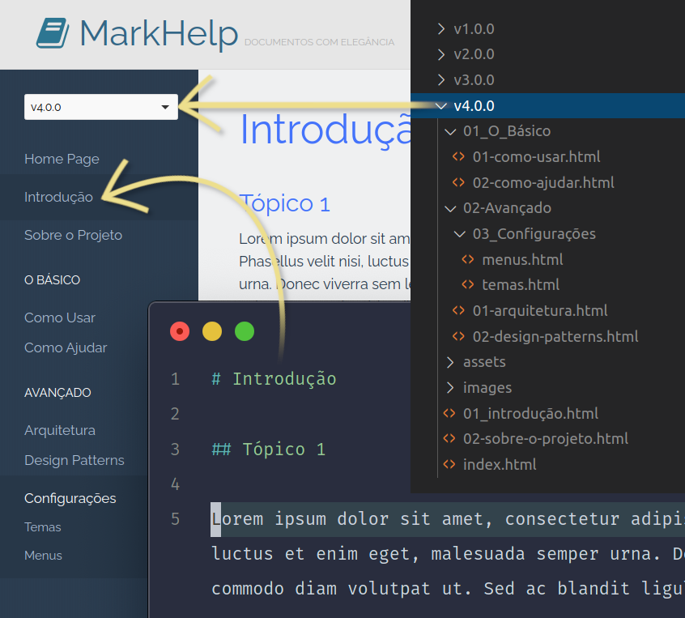

# Personalizando e configurando

O MarkHelp é capaz de transformar qualquer projeto contendo arquivos markdown em HTML, formatando-os de uma forma padrão. Mas é possível personalizar várias coisas, de forma que a geração dos documentos se adapte às mais diversas necessidades.

## 1. Configurações avançadas

O MarkHelp possui várias configurações pontuais, que mudam seu comportamento no momento da renderização de páginas HTML.

Essas configurações podem ser especificadas criando um arquivo `config.json` dentro do projeto markdown, ou especificando sua localização diretamente na [implementação](utilizar-como-biblioteca.md) ou na [linha de comando](utilizar-no-terminal.md) do MarkHelp. 

Abaixo, seguem todas elas:

* **path_theme**: define o caminho completo até o tema desejado. Os temas padrões se encontram no diretório [src/Themes](https://github.com/ricardopedias/markhelp/tree/master/src/Themes/) do código fonte do MarkHelp. Você pode copiar este diretório, fazer as alterações desejadas no tema e passar seu caminho completo neste parâmetro de configuração;
* **clone_url**: define a url para acessar o repositório do projeto;
* **clone_directory**: define o diretório, dentro do repositório do git, de onde a documentação em markdown deverá ser extraída;
* **clone_tags**: define as `tags` a serem usadas como versões do documento. Para especificar mais de uma `tag`, basta adicioná-las separadas por vírgula.
* **copy_name**: o nome da pessoa/instituição detentora dos direitos da documentação renderizada;
* **copy_url**: a url para o site da pessoa/instituição detentora dos direitos;
* **project_name**: define o nome do projeto ao qual a documentação renderizada se refere;
* **project_slogan**: define uma pequena frase, que aparecerá no cabeçalho, como slogan do projeto;
* **project_fork**: define se a bandeira de "Faça um fork" deverá, ou não aparecer [true ou false]; 
* **project_description**: define um texto descritivo para a documentação ser indexada pelos mecanismos de busca. Especifique no máximo 255 caracteres para uma boa descrição;
* **project_logo_status**: define se o logotipo aparecerá ou não no cabeçalho das páginas HTML. Por padrão, o valor setado é `true`;
* **project_logo**: define o caminho até o logotipo da documentação. Por padrão, o logotipo do MarkHelp será utilizado;

> **Observação**: usando o MarkHelp para implementar em projetos PHP, é possível setar configurações pontuais, sem a necessidade de usar um arquivo `config.json`. Para mais informações, confira [Implementando projetos PHP](utilizar-como-biblioteca.md).

## 2. Personalizando o menu lateral

Para personalizar o menu lateral basta adicionar um arquivo `menu.json` dentro do projeto markdown, ou especificar sua localização absoluta (caminho completo) diretamente no MarkHelp através da configuração avançada (que será abordada a seguir). 

Este arquivo deve possuir a seguinte formatação:

```json
{
    "Item Simples 1" : "item-um.md",
    "Item Simples 2" : "item-dois.md",

    "Titulo 1" : {
        "Item Agrupado 1" : "Diretório Um/item-três.md",
        "Item Agrupado 2" : "Diretório Um/item-quatro.md"
    },

    "Título 2": {

        "Item Agrupado 3" : {
            "Subitem 1" : "Diretório Dois/item-cinco.md",
            "Subitem 2" : "item-seis.md",
            "Subitem 3" : "item-sete.md"
        },

        "Item Agrupado 4" : {
            "Subitem 4" : "Diretório Três/item-oito.md",
            "Subitem 5" : "Diretório Três/item-nove.md"
        }
    }
}
```

### Entendendo a estrutura

Analisando o objeto Json, vejamos o que significa cada item na estrutura:

1. **Nível 1**: se o valor for uma url, esses itens serão renderizados diretamente no primeiro nível do menu;
2. **Nível 1 (objeto como valor)**: se o valor for um outro objeto, os itens dele serão considerados *grupos de itens*. Isso significa que eles serão agrupados em um bloco delimitado por um título;
3. **Nível 2**: se o valor for uma url, esses itens serão renderizados diretamente no menu, dentro da delimitação do título;
4. **Nível 2 (objeto como valor)**: se o valor for um outro objeto, os itens dele serão considerados um *submenu*. Isso significa que eles estarão ocultos, devendo ser clicado no item para expandir os demais *sub-items*;

Abaixo, um exemplo desta estrutura após a renderização.




## Sumário

-   [Início](index.md)
-   [Implementando projetos PHP](utilizar-como-biblioteca.md)
-   [Utilizando no Terminal Linux](utilizar-no-terminal.md)
-   [Personalizando e Configurando](configuracoes.md)
-   [Quero ajudar o projeto](como-ajudar.md)
