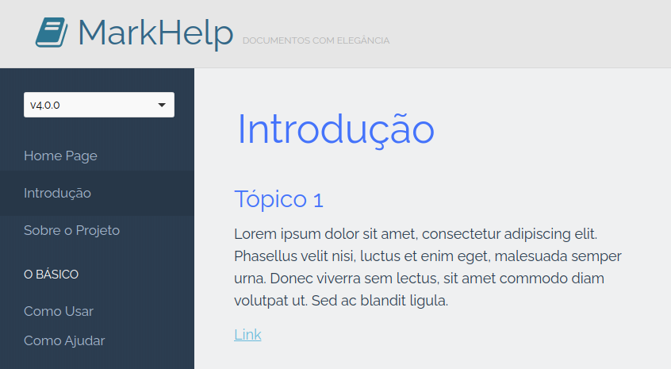

# MarkHelp

Com MarkHelp você é capaz de gerar belíssimas páginas HTML para seus documentos escritos em Markdown.
Simples de usar dentro ou fora de seus projetos.

Sinta-se à vontade para conferir o [changelog](https://github.com/ricardopedias/markhelp/blob/master/changelog.md), os [releases](https://github.com/ricardopedias/markhelp/releases) e a [licença](https://github.com/ricardopedias/markhelp/blob/master/license.md).

Veja também a [Documentação do MarkHelp](docs/index.md)

## Características

-   Feito para o PHP 7 ou superior;
-   Codificado com boas práticas e máxima qualidade;
-   Bem documentado e amigável para IDEs;
-   Feito com TDD (Test Driven Development);
-   Feito com :heart: & :coffee:.

## Créditos 

Orgulhosamente criado por [Ricardo Pereira Dias](http://www.ricardopedias.com.br)