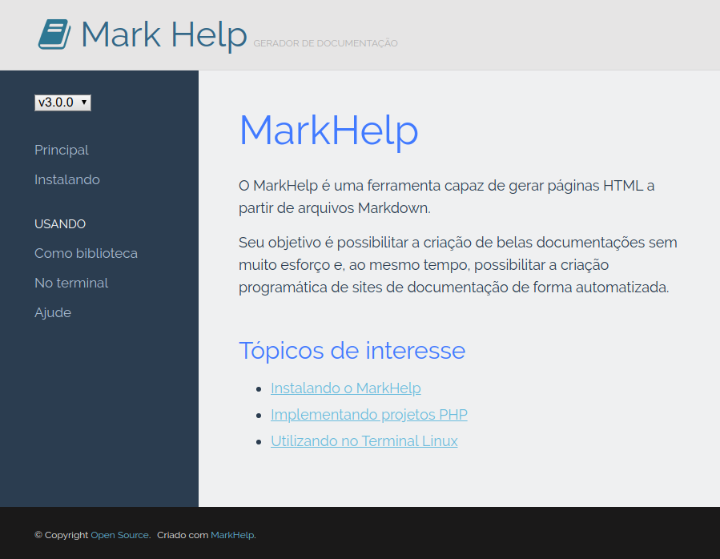

# MarkHelp

O MarkHelp é uma ferramenta capaz de gerar páginas HTML a partir de arquivos Markdown.

Seu objetivo é possibilitar a criação de belas documentações sem muito esforço e, ao mesmo tempo,
possibilitar a criação programática de sites de documentação de forma automatizada.

Sinta-se à vontade para conferir o [changelog](https://github.com/ricardopedias/markhelp/blob/master/changelog.md), os [releases](https://github.com/ricardopedias/markhelp/releases) e a [licença](https://github.com/ricardopedias/markhelp/blob/master/license.md).

## Tópicos de interesse

-   [Instalando o MarkHelp](instalando.md)
-   [Implementando projetos PHP](utilizar-como-biblioteca.md)
-   [Utilizando no Terminal Linux](utilizar-no-terminal.md)
-   [Personalizando e Configurando](configuracoes.md)
-   [Quero ajudar o projeto](como-ajudar.md)
