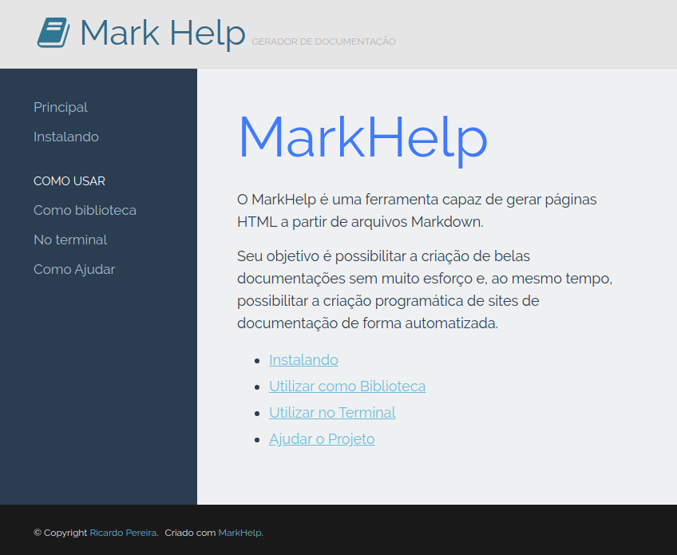

# Instalando o MarkHelper

Com MarkHelp você é capaz de gerar belíssimas páginas HTML para seus documentos escritos em Markdown.
Simples de usar dentro ou fora de seus projetos.

## Em projeto PHP

Para utilizar o MarkHelp em qualquer projeto PHP, basta instalar 
o pacote de software usando o composer:

```bash
composer require ricardopedias/markhelp
composer update
```

Após a atualização do composer, basta instanciar o MarkHelper e usar:

```php
include 'vendor/autoload.php';

$app = new MarkHelp('/meus/arquivos/markdown/');
$app->loadConfigFrom('/minhas/configurações/personalizadas/config.json');
$app->saveTo('/meu/site/html');
```

## Em ambiente Linux

Para utilizar o MarkHelp como um comando dentro de um sistema operacional 
baseado em Debian Linux, basta efetuar os seguintes passos:

```bash
git clone https://github.com/ricardopedias/markhelp.git
cd markhelp
./make-deb-package.sh
```

Um pacote chamado markhelp_9.9.9_all.deb será gerado no mesmo diretório. 
Basta instalar este pacote com o gerenciador de pacotes de sua preferência 
e começar a usar o MarkHelp em sua distribuição.

- [Página 1](01-page-one.md)
- [Página 2](02-page-two.md)
- [Página 3](01_O_Básico/01-page-three.md)
- [Página 4](01_O_Básico/02-page-four.md)
- [Página 5](02_Avançado/01-page-five.md)
- [Página 6](02_Avançado/02-page-six.md)

